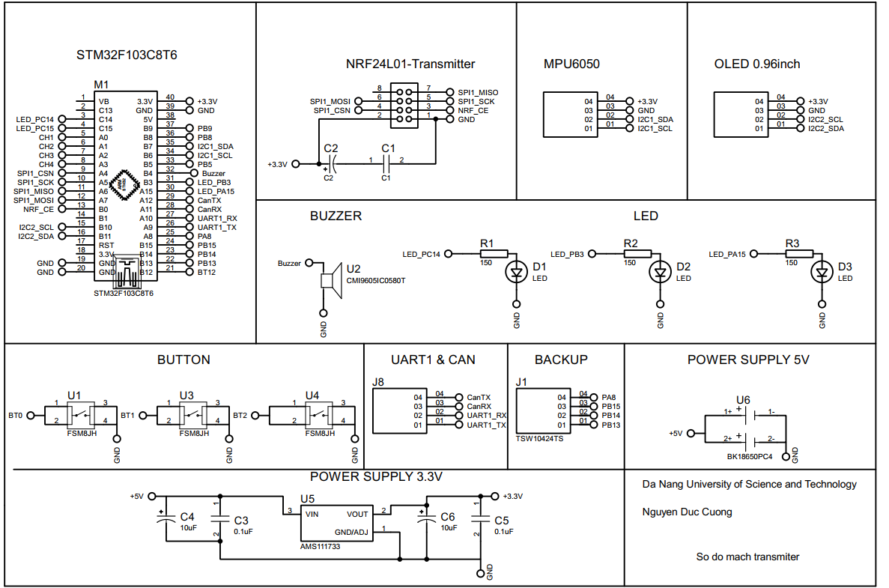
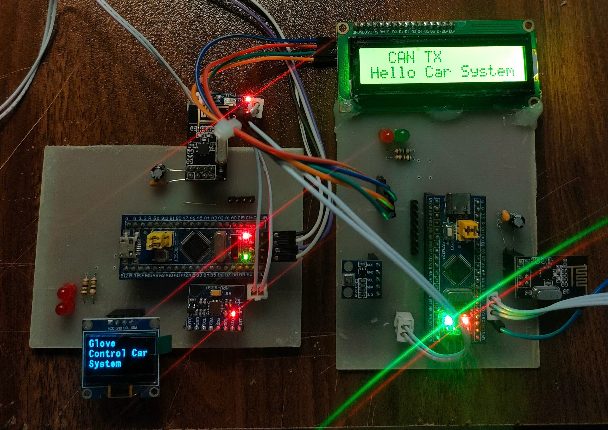
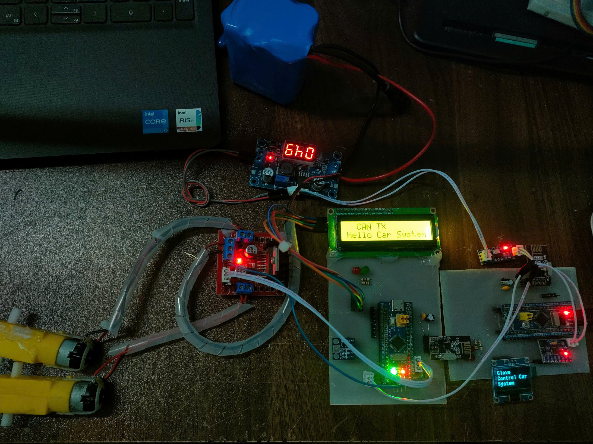
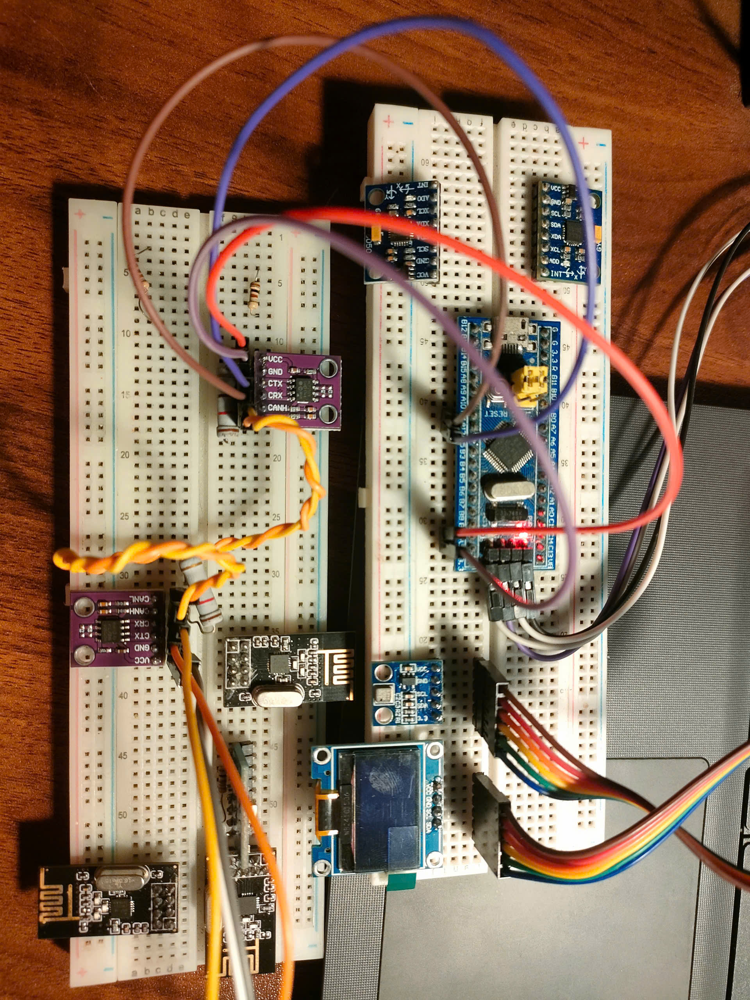

# Glove Control Car

- Đây là project điều khiển hệ thống xe thông qua găng tay từ xa của Cường

- Tóm tắt project:

    - Hệ thống sử dụng 3 STM32F103C8T6. 1 vi điều khiển dùng làm mạch điều khiển từ xa (găng tay), 2 vi điều khiển còn lại được sử dụng cho hệ thống xe

    - Găng tay điều khiển thông qua module NRF24L01, sử dụng giao tiếp SPI, dựa vào dữ liệu trả về từ cảm biến gia tốc MPU6050 (Roll & Pitch Angle) để điều khiển xe Tiến, Lùi, Trái, Phải. Màn hình OLED 0.96 inch hiển thị cấu hình

    - Ở hệ thống xe, mỗi ECU có một LCD để hiển thị trạng thái, ECU1 sẽ gửi tín hiệu, độ cao, nhiệt độ từ cảm biến áp suất BMP180 dến ECU2 thông qua giao tiếp CAN.

## 1. Sơ đồ nguyên lý

- Sơ đồ nguyên lý mạch Transmitter, tương tự cho mạch Receive

## 2. Mạch điều khiển 

- Ảnh demo hệ thống

- Ảnh test giao tiếp CAN:

## 3. Video test từng module và cảm biến, demo hệ thống xe

- Roll, Pitch Angle MPU6050: https://youtu.be/60cJt33BhFY

- Test module NRF24L01: https://youtu.be/E36QYzZgeaQ

- Test giao tiếp CAN: https://youtu.be/9uMUa1t9GnI

- Demo hệ thống: https://youtu.be/eSCSYfjnwHw

